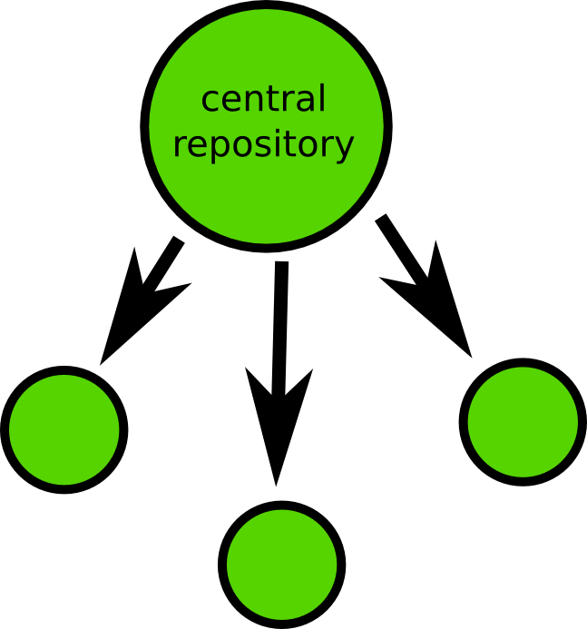
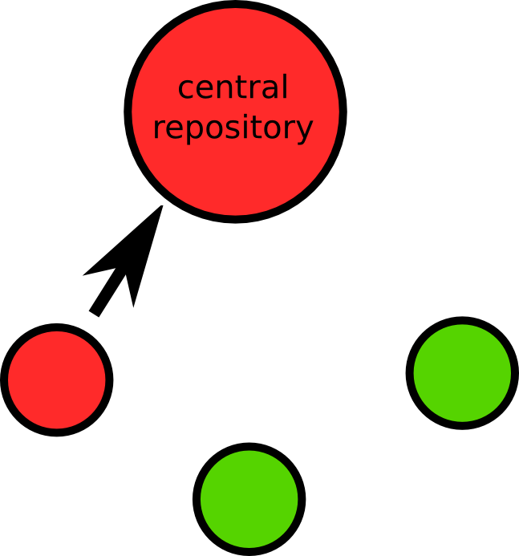
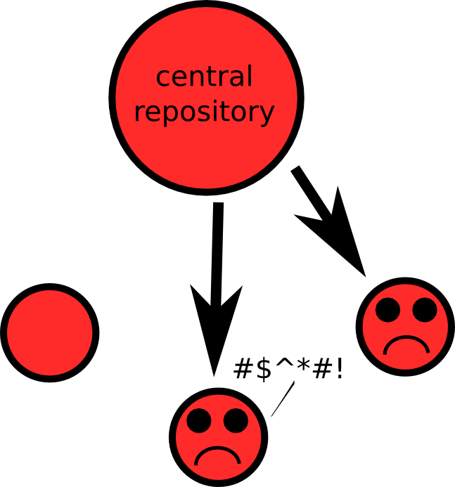
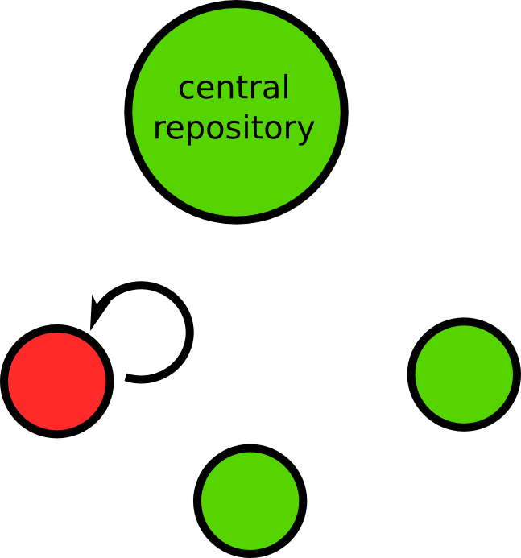
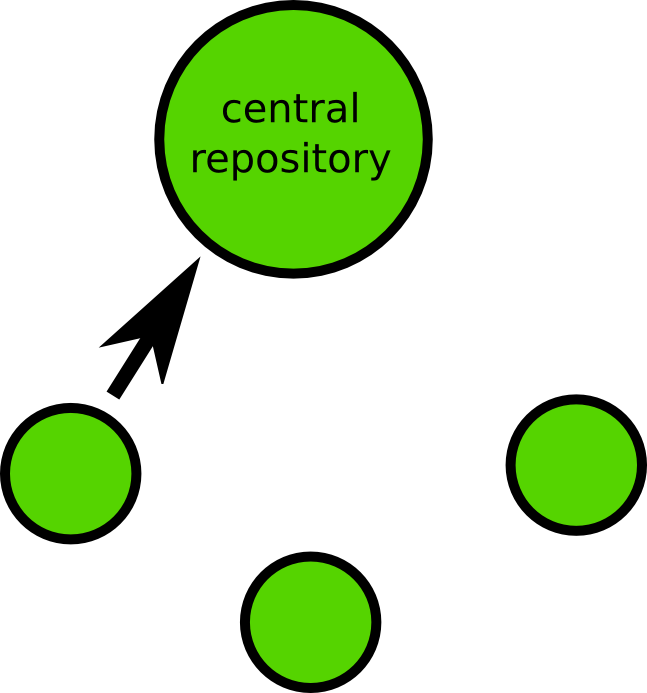
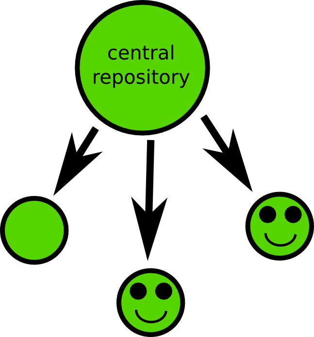
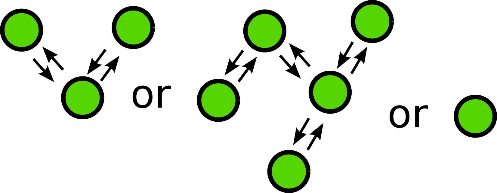

Centralized version control
===========================

- CVS, Subversion
- One main repository
- Commits go to central repository

Centralized version control
===========================

Developers check out working copies.

  

Someone commits bad code to repository.

  

Changes are visible to everyone.

  

Distributed version control
===========================

Most recent version control systems use a distributed model.

Developers check out working copies.

  

Distributed version control
===========================

Someone commits bad code to local repository.

  

Fixes locally and pushes to remote repository.

  

Everyone is happy.

  

There is no spoon.

  

.. container:: handout

   In the world of distributed version control, the idea of a central
   repository is a social construct rather than a technical one.  While
   some projects may find it convenient to identify a central repository,
   git (and other DVC systems) do not enforce a hub and spoke
   configuration.

   For some of my own projects I have something of an "inverted tree": my
   working copies push to two remote repositories.  One is a "personal"
   repository, which I use to coordinate my work between my office, my
   laptop, and so forth.  The other is a "public" repository, where I push
   my code when I want others to see it.

Centralized vs. Distributed
===========================

It may sound like I am suggesting that distributed version control is
generally better than centralized version control.

- I am.
- There are other opinions.

   In particular, some of the developers of Subversion have suggested that
   a distributed model makes it less likely that people will share code
   with others (while in a centralized system they are largely forced to if
   they want to take advantage of the version control system).

