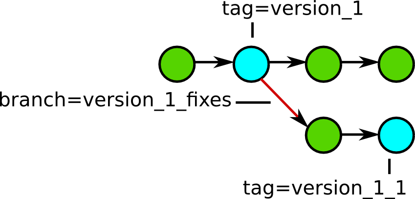

Vocabulary
==========

*Repository*
  A database containing the files and change history of your project.

*Working tree* or *Working copy*
  A local copy of files from a repository.

Vocabulary
==========

*Revision*
  The state of the repository at a certain point in time.

*Commit*
  To save your changes back to the repository.

*Merge*
  To combine two sets of changes to the files in your project.

Vocabulary
==========

*Tag*
  Identifies a point-in-time snapshot of your project.

*Branch*
  An isolated stream of changes to your project.

Vocabulary
==========

